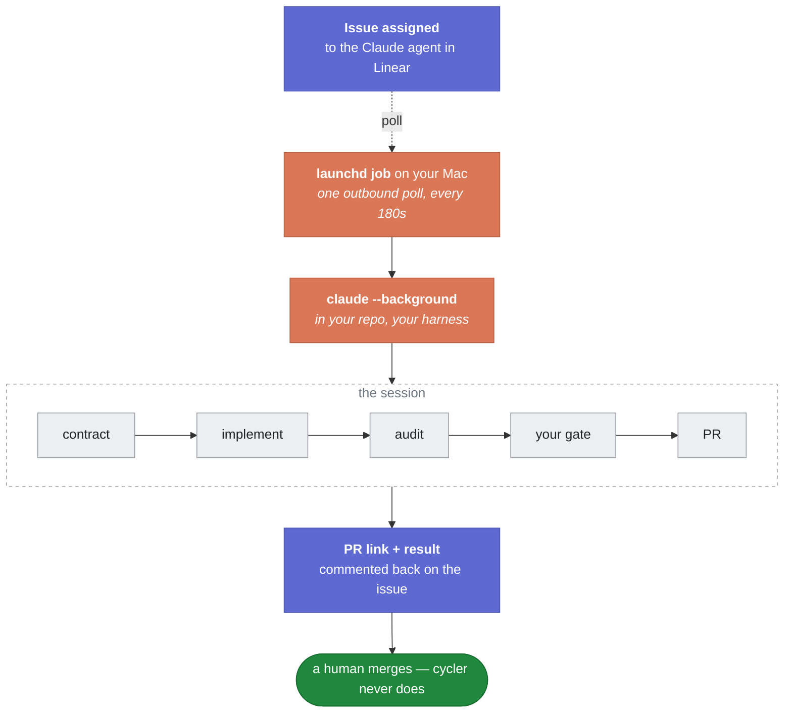

<p align="center">
  <picture>
    <source media="(prefers-color-scheme: dark)" srcset="docs/assets/logo-dark.png">
    <source media="(prefers-color-scheme: light)" srcset="docs/assets/logo-light.png">
    
  </picture>
</p>

<h1 align="center">Assign an issue to a local harness. Get a gated pull request back.</h1>

<p align="center">
  On your machine · your harness · your gate · no cloud, no tunnel
</p>

<p align="center">
  <a href="https://github.com/mikhailkogan17/cycler/releases/latest"></a>
  <a href="LICENSE"></a>
  
  
</p>

---

## What is cycler

A Claude Code plugin with four parts:

- **Linear OAuth app** — the agent 'teammate' for assigning an issue to;
- **poller** — checks Linear for issues assigned to the agent, every 180 seconds;
- **dispatch** — starts a background harness session in your repo, remote control on;
- **workflow** — Contract → Branch → Implement → Audit → Verify → Commit → PR → Review →
  Follow-ups → Cleanup.

You assign the issue and close the tab.<br>
The session comments when it starts, when it has open questions, and when the PR is up.

## Alternatives

The board can hand work to plenty of agents. What cycler does differently is run it with **no hosted
component in the path** — no hub, no relay, no account beyond your own Linear app — and install as a
Claude Code plugin rather than a service you deploy and keep alive.

| Project | |
|---|---|
| [**cyrus**](https://github.com/cyrusagents/cyrus) | Its own harness and its own child agents. BYOK, so its token cost is yours, and the workflow isn't. Paid tiers route through their cloud. |
| [**Symphony**](https://github.com/openai/symphony) | Also polls the board — but Codex only, and it ships as a spec plus an Elixir reference implementation, not something you install. |
| [**Multica**](https://github.com/multica-ai/multica) | A self-hostable workspace you run and operate. Drives 20 agent CLIs; the setup is a platform, not a plugin. |
| [**zeroshot**](https://github.com/the-open-engine/zeroshot) | Planner, implementer and validators looping until verified. Strong on verification, but you point it at an issue — the board doesn't delegate to it. |
| [**flow-next**](https://github.com/gmickel/flow-next) | Syncs specs to Linear two-way, but *you* start every run. The board can't trigger one. |
| **Copilot / Codex Linear Agent** | Cloud execution only. No choice of gate, no choice of workflow, and your repo leaves your machine. |

---

## Install

**Requirements:**
- macOS
- Node 18+
- [Claude Code](https://claude.com/claude-code)
- a Linear workspace you can create an OAuth application in

1. In a terminal:

   ```bash
   claude plugin marketplace add mikhailkogan17/cycler
   claude plugin install cycler@cycler
   claude /cycler:start
   ```

2. In Linear, assign an issue to the Claude agent.

## Usage
### Commands
| command | does |
|---|---|
| `/cycler:start` | set up whatever is missing, then start polling |
| `/cycler:stop` | unload the launchd job |
| `/cycler:delegate <KEY>` | put one issue on the agent and dispatch it now — the board's assign button, from here |
| `/cycler:doctor` | diagnose the nine things that actually break |

> [!TIP]
> `/cycler:start` checks your setup and adds whatever is missing: the config, the Linear OAuth
> app, and the launchd job. Safe to re-run.

> [!CAUTION]
> **Anyone who can assign an issue to the agent can run code on your machine.**
> The issue becomes the prompt of a Claude Code session in your repo.
> On a shared one, restrict who can assign your issues to an agent.

### Workflows
| workflow | for |
|---|---|
| `/cycler:workflow-feature` | a feature, improvement, tech debt — contract → implement → audit → gate → PR |
| `/cycler:workflow-bug` | the same lifecycle in bugfix mode: the regression test comes before the fix |
| `/cycler:workflow-research` | a question whose deliverable is a decision, not a diff. No contract, no gate |
| `/cycler:workflow-intake` | writing a contract by hand first, then handing it to `workflow-feature`. Optional |

> [!IMPORTANT]
> The poller runs these for you, inside the dispatched session. You can also run one here, in the
> **current** session, on an issue that was never assigned to the agent.

---

## Config

Path: `~/.config/cycler/config.yaml`.
Every key is optional.

```yaml
linear:
  client_id: ********
  client_secret: ********

repo:
  path: ~/your-repo
  base: main
  branch_prefix: claude/

workflows:
  default:  /cycler:workflow-feature   # contract → implement → audit → gate → PR
  bug:      /cycler:workflow-bug       # the same, in fix mode
  research: /cycler:workflow-research  # a decision, not a diff

dispatch:
  command: >
    claude --background --name "{session}" --remote-control "{session}"
    --remote-control-session-name-prefix linear --permission-mode auto
    --append-system-prompt "Started by cycler for {issue}" "{workflow} {issue}"
  path_prepend: [~/.local/bin, ~/bin, /opt/homebrew/bin, /usr/local/bin]
```

[**Example**](cycler.example.yaml)  |  [**Full reference**](docs/specs/002-config.md)

---

## How it works



> [!NOTE]
> The poller only makes one outbound request every 180 seconds, and **never an LLM call**.
> Every token is spent by the harness itself, **after it dispatches a session**.

<details>
<summary>Design notes</summary>

- **The contract comes first.** Goal, non-goals, allowed and forbidden paths, acceptance checks as
  exact commands. Every requirement line carries a provenance tag — `[user]`, `[paraphrase]`,
  `[inferred]` — so a later reader can tell which constraints came from the issue and which the
  agent invented.
- **The rules are enforced outside the agent.** Four `PreToolUse` hooks: no edits before a contract
  exists, no commit on a red gate, a large change goes through the full workflow instead of inline,
  no writes outside the session's worktree. Prose can be argued with; a hook cannot.
- **Audit is arithmetic before it is judgement.** A script checks paths, scope, secrets and whether
  the run edited its own contract. Only then does an agent answer what a script cannot.
- **Review runs four lenses in parallel** — bugs, contract, test gaps, scope creep. Only blocking
  findings get an adversarial refuter, and only the lens that raised one is re-run after a fix.
- **A dispatched session has to prove it started.** `claude --background` returns an id immediately
  and the session can still die on its first turn; without a start marker, four dead dispatches once
  read as four successes.
- **Follow-ups become tracked issues**, not paragraphs in a PR description nobody reads.

The rule underneath all of it: **green is only evidence if the check could have gone red.** Eight
checks in this harness's history turned out to be incapable of failing on the input they judged — a
predicate that returned a literal `true`, a cross-language check that matched its own doc comment, a
Swift gate that skipped Swift, a config-driven test whose config was never loaded. Writing the check
is not the work. Watching it go red is.

Decisions are recorded as ADRs in [`docs/adr/`](docs/adr/); [`docs/specs/`](docs/specs/) is the
behavioural spec each part is written against.

</details>

## Troubleshooting

`/cycler:doctor` checks all of these and tells you which one you have.

| symptom | cause |
|---|---|
| Worked yesterday, 401 today | Linear tokens expire in 24h; the refresh needs `client_id` and `client_secret` |
| Job loaded, nothing happens | `launchctl` addresses jobs by **label**; the plist filename has to match it |
| Session stalls asking where `node` is | launchd's bare `PATH` — set `dispatch.path_prepend` |
| The gate always passes | no `.claude/harness/gate.sh` and no lint/build/test script |

---

## Contributing

Spec → failing test → code → gate, in that order. [`CONTRIBUTING.md`](CONTRIBUTING.md) has the rest.

## Author

**[Mikhail Kogan](https://github.com/mikhailkogan17)**

## License

[`MIT`](LICENSE).
