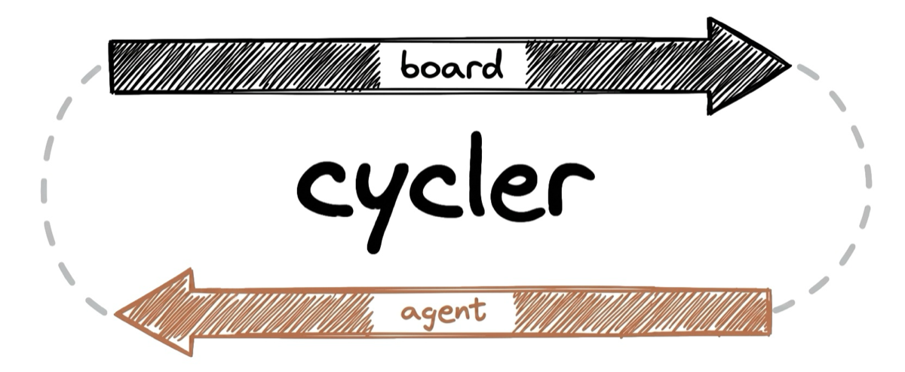

<p align="center">
  <picture>
    <source media="(prefers-color-scheme: dark)" srcset="docs/assets/logo-dark.png">
    <source media="(prefers-color-scheme: light)" srcset="docs/assets/logo-light.png">
    
  </picture>
</p>

<p align="center"><b>Delegate a Linear issue to Claude and get a gated pull request back.</b></p>

A poller on your own machine watches Linear for issues delegated to a Claude agent. When one appears
it starts a background Claude Code session in your repo. That session writes a contract, implements
against it, runs your gate, opens a PR, and comments the result back on the issue.

Everything runs locally. There is no service to sign up for, nothing listening on your machine, and
no tunnel: the poller makes an outbound request every 180 seconds to an OAuth app in your own Linear
workspace. The poller itself never calls a model — every token is spent by the session you configured.

## Requirements

- macOS (the poller runs as a launchd agent)
- Node 18+
- Claude Code
- A Linear workspace you can create an OAuth application in

## Install

In Claude Code:

```
/plugin marketplace add mikhailkogan17/cycler
/plugin install cycler@cycler
/cycler:setup
/cycler:start-polling
```

`/cycler:setup` walks the Linear OAuth application, runs the authorisation, writes `cycler.yaml`, and
verifies one poll. `/cycler:start-polling` installs the launchd job.

Check it any time with `/cycler:doctor`, which tests the six things that actually break rather than a
generic checklist.

Then, in Linear, **delegate** an issue to the Claude agent. Delegate, not assign — they are different
fields, and assigning dispatches nothing while looking correct.

## Commands

| command | does |
|---|---|
| `/cycler:setup` | one-time setup: OAuth app, token, `cycler.yaml`, verified first poll |
| `/cycler:start-polling` | install and load the launchd job |
| `/cycler:stop-polling` | unload and remove it |
| `/cycler:start <KEY>` | dispatch one issue now |
| `/cycler:doctor` | diagnose token, launchd job, paths, gate, and the delegate trap |

## Configuration

`cycler.yaml` at the repo root. Every key is optional; see
[`cycler.example.yaml`](cycler.example.yaml) for the full annotated file.

```yaml
repo:
  path: ~/your-repo
  base: main
  branchPrefix: claude/
routes:
  default: /cycler:task
  byLabel:
    - label: research
      workflow: /cycler:research
```

Secrets are not in this file. The Linear client id, secret and token live in `~/.cycler/`, so
`cycler.yaml` can be committed without thinking about it.

## What the session actually does

`/task` runs a contract-first workflow: **Contract → Branch → Implement → Audit → Verify → Commit →
PR → Review → Follow-ups → Cleanup**.

- **The contract comes first.** Goal, non-goals, allowed and forbidden paths, and acceptance checks
  written as exact commands. Everything downstream is judged against it, and requirement lines carry
  a provenance tag — `[user]`, `[paraphrase]`, `[inferred]` — so a later reader can tell which
  constraints came from the issue and which the agent invented.
- **The rules are enforced outside the agent.** Four `PreToolUse` hooks: no edits before a contract
  exists, no commit on a red gate, a large change must go through the full workflow rather than
  inline, and no writes outside the session's worktree. Prose can be argued with; a hook cannot.
- **Audit is arithmetic before it is judgement.** A script checks paths, scope, secrets and whether
  the run edited its own contract. Only then does one agent answer the question a script cannot: are
  the acceptance checks actually met by this diff?
- **Review runs four lenses in parallel** — bugs, contract, test gaps, scope creep. Only blocking
  findings get an adversarial refuter, and only the lens that raised one is re-run after a fix.
- **Follow-ups become tracked issues**, not paragraphs in a PR description nobody reads.

The rule underneath all of it: **green is only evidence if the check could have gone red.** Six
checks in this harness's history turned out to be incapable of failing on the input they judged — a
predicate that returned a literal `true`, a cross-language check that matched its own doc comment, a
Swift gate that skipped Swift. Each of them looked green for weeks.

## The gate is yours

cycler does not own your gate — it always depends on the repo and the stack. Resolution order:

1. `.claude/harness/gate.sh` in your repo — used whenever it exists
2. cycler's default — `lint`, `build` and `test` from `package.json`

To write your own, copy `harness/gate.default.sh` into your repo at `.claude/harness/gate.sh` and
replace the checks. What you inherit is the runner: argument handling, the changed-file sets, one
line of output per passing check, and the pass marker the commit hook reads.

If a repo has no gate and no lint/build/test script, the default reports **FAIL**, not a pass. A gate
that checked nothing must not read as green.

## Security — what delegating actually grants

**Read this before pointing cycler at a workspace other people can write to.**

The trigger is narrow by design: the poller selects issues by the **delegate** field and nothing else.
It does not act on comments, on mentions, or on assignment. Writing a comment on an issue — or on a
pull request — starts nothing. Nothing listens on your machine, and no inbound request can reach it.

What a delegation *does* grant is significant. The issue's title and description become the prompt of
a Claude Code session running in your repository, by default with `--permission-mode auto`. So:

> **Anyone who can delegate an issue to the agent can run code on your machine.**
> Treat delegate rights as equivalent to repository write access plus a shell.

That is the correct mental model, and it is not softened by anything cycler does. The mitigations that
do exist:

- **The dispatch command is built without a shell.** Placeholders are substituted *after* the command
  is split into arguments, so an issue title containing quotes, backticks or `$(…)` cannot introduce
  an argument or execute anything. There is a test for this.
- **The harness constrains what a run may touch** — a contract with allowed and forbidden paths, a
  hook that denies edits outside them, a hook that denies commits on a red gate, and a hook that
  denies writes outside the session's worktree.
- **It opens pull requests and never merges.** Every change still passes a human.

None of that is a substitute for trusting the people who can delegate. On a solo workspace — the case
cycler is built for — this is a non-issue. On a shared one, restrict who can delegate to the agent.

## Why the comments cite issue keys

Much of this codebase explains itself with references like `APL-41` or `APL-48`. They are issue keys
from the project cycler grew in, and you cannot look them up. They are kept deliberately.

A rule with no evidence is a rule people override. "More than 8 files goes through the full workflow"
invites an exception; "APL-41 ran inline past this limit: 331 turns, $8.68, context peaking at 216k,
61% of it in cache reads" does not. The key is just a citation marker — every one of them is followed
by the finding it refers to, in the same comment. What matters is the measurement, and that is always
there in full.

## Design decisions

The reasoning behind the load-bearing choices — polling instead of webhooks, shipping as a plugin,
leaving the gate in your repo, routing by label rather than by classifier — is recorded as ADRs in
[`docs/adr/`](docs/adr/). [`docs/specs/`](docs/specs/) is the behavioural spec each part is written
against, and [`CONTRIBUTING.md`](CONTRIBUTING.md) explains how a change moves through spec → test →
code here.

## License

MIT
